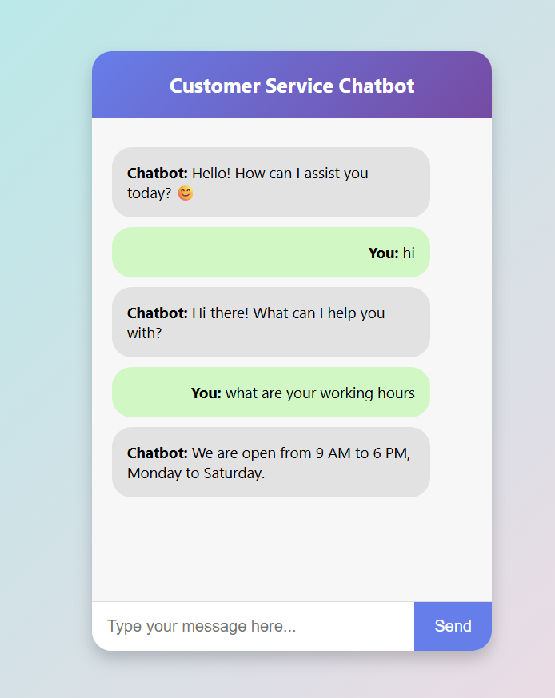

# 🤖 Chatbot Project  

An AI-powered chatbot built using **Python** and **Natural Language Processing (NLP)** techniques. The chatbot can understand user input and provide automated responses, simulating human-like conversation.  

  

---

## ✨ Features  

- 💬 *Interactive chatbot* for text-based conversations  <br/>
- 🧠 *NLP techniques* for understanding user queries  <br/>
- 🔄 *Rule-based + ML-powered responses*  <br/>
- 📚 *Trained on sample conversational data*  <br/>
- ⚡ *Lightweight & easy to extend*  <br/>

---

## 📦 Project Structure  

chatbot-project/ <br/>
├── chatbot.ipynb # Jupyter Notebook with model & logic<br/>
├── intents.json # Dataset of intents and responses<br/>
├── model.pkl # Saved chatbot model<br/>
├── requirements.txt # Required dependencies <br/>
└── README.md # Project documentation <br/>


---

## 🚀 Getting Started  

1. **Clone the repository**  
   ```bash
   git clone https://github.com/delljigyanshu/Chatbot-project.git
   cd Chatbot-project
   ```
   
```bash
2.Install dependencies
pip install -r requirements.txt
```

```bash
3.Run the chatbot

Open chatbot.ipynb in Jupyter Notebook / Jupyter Lab.
Train and test the chatbot by executing the cells.
```

## 🛠 Built With

- Python 🐍 <br/>
- NLTK / TensorFlow / Keras <br/>
- Scikit-learn <br/>
- Pandas & NumPy <br/>
- Jupyter Notebook <br/>

## ✏ Customization Ideas

🌐 Deploy as a web app using Flask or Django <br/>
💬 Integrate with messaging platforms (Telegram, WhatsApp, Slack) <br/>
🧠 Use advanced NLP models (BERT, GPT) for improved responses <br/>
🎨 Add a GUI using Tkinter or Streamlit <br/>

## 🙋‍♂ Author

Jigyanshu Agrawal <br/>
GitHub: [@delljigyanshu](https://github.com/delljigyanshu/Chatbot-project) <br/>
LinkedIn: [Jigyanshu Agrawal](https://www.linkedin.com/in/jigyanshu-agrawal?utm_source=share&utm_campaign=share_via&utm_content=profile&utm_medium=android_app )

